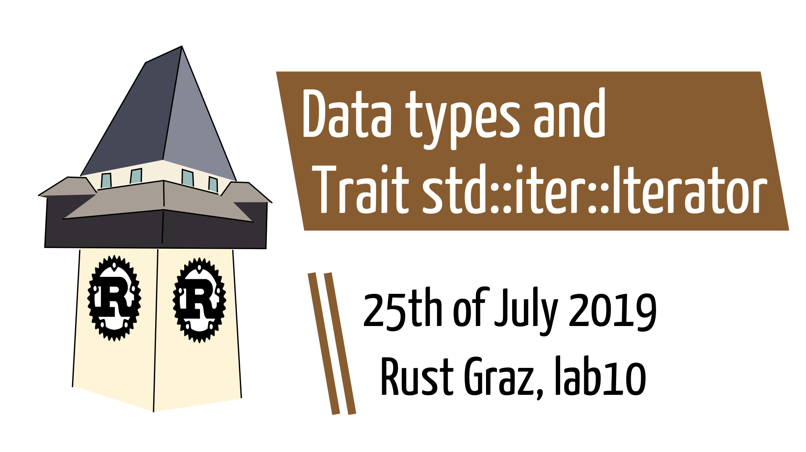
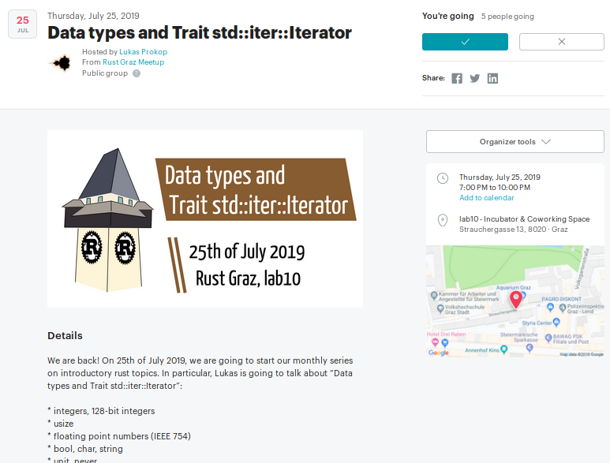
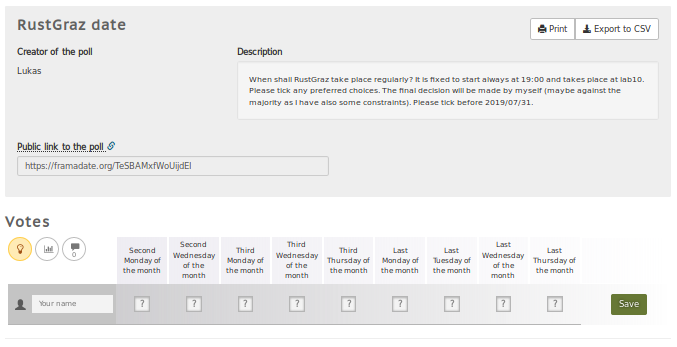
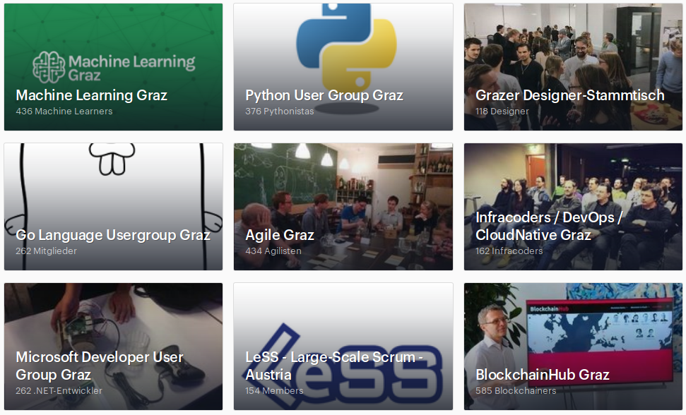
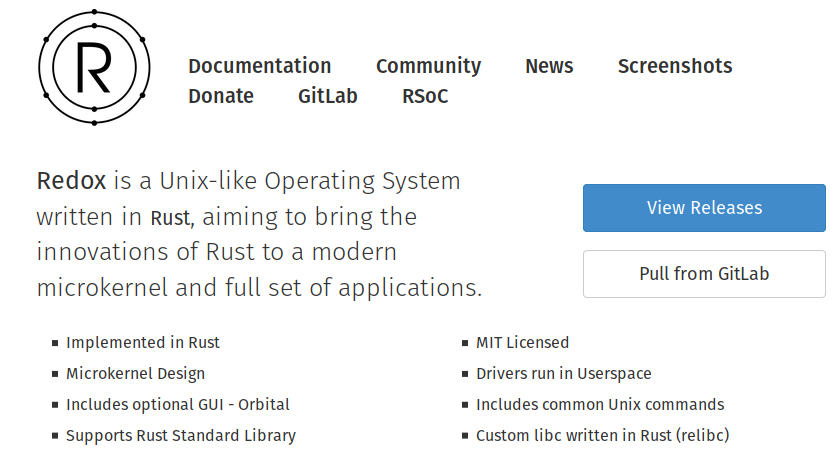

---

## Welcome back!

After one year w/o a talk, we are going to reboot RustGraz.

1. Regular talks each month.
2. Starting with introductory topics in summer 2019.
3. English as preferred language to include internationals.

---

## About the meetup

---

## Organization via meetup

---

### Which date?

[survey via framadate.org/TeSBAMxfWoUijdEI](https://framadate.org/TeSBAMxfWoUijdEI)

---

### Annoucements also via twitter

---

### Resources on github

[github.com/rust-user-group-graz](https://github.com/rust-user-group-graz)

Today:  
[…-graz/00-intro](https://github.com/rust-user-group-graz/00-intro), 
[…-graz/01-getting-started](https://github.com/rust-user-group-graz/01-getting-started),  
[…-graz/02-datatypes-and-iterator](https://github.com/rust-user-group-graz/02-datatypes-and-iterator)

---

### About rust

Why a meetup about rust? We have a bunch of other meetups going in Graz.

---

## About the state of rust

rust is a *multi-paradigm* *system* programming language focused on *safety*, especially *safe concurrency* (via [Wikipedia](https://en.wikipedia.org/wiki/Rust_(programming_language))) and a *rich type system* and *ownership model* guaranteeing memory-safety and thread-safety (via [rust-lang.org](https://www.rust-lang.org/)).

Ok. But does it work?

---

### Current state of Rust: some projects

* [Mozilla Research](https://research.mozilla.org/rust/) published rust to improve Firefox ([Firefox Quantum](https://blog.mozilla.org/firefox/quantum-performance-test/), v57, 2×speed, 30% less RAM than Chrome, [75% of Firefox's code rewritten](https://www.webdesignerdepot.com/2017/11/is-firefox-quantum-really-any-good/), [5 mio. LOCs](https://www.webdesignerdepot.com/2017/11/is-firefox-quantum-really-any-good/), [servo project](https://github.com/servo/servo))

---

### Current state of Rust: some projects

* [pairity.io](https://www.parity.io/) develops the “fastest and most advanced Etherum client“ (Pairity Etherum), “a framework for building blockchains and spawning decentralised innovation“ (Parity Substrate), “the next-generation platform for connecting independent blockchains together“ (Polkadot) and others.

---

### Current state of Rust: some projects

* [npm registry uses rust for its CPU-bound bottlenecks](https://www.rust-lang.org/static/pdfs/Rust-npm-Whitepaper.pdf)
* Several components of the [Dropbox core file-storage system were written in Rust](https://www.rust-lang.org/production) to pursue greater datacenter efficiency

---

### Current state of Rust: some projects

* [Redox (redox-os.org)](https://www.redox-os.org/) is a Unix-like Operating System written in Rust, aiming to bring the innovations of Rust to a modern microkernel and full set of applications
* “Writing an OS in Rust” ([os.phil-opp.com](https://os.phil-opp.com/))

---

### Current state of Rust: some projects

* [Jix (jix.one)](https://jix.one/) implements a SAT solver [“Varisat”](https://jix.one/project/varisat/) in rust and blogs about its design
* [TLS performance: rustls versus OpenSSL](https://jbp.io/2019/07/01/rustls-vs-openssl-performance.html) (15% quicker to send data, 5% quicker to receive data, 30-70% quicker to resume a client connection, …, uses less than half the memory of OpenSSL)

---

### Current state of Rust

* For the fourth year in a row, Rust is the __most loved¹__ programming language among our respondents, followed close behind by Python, the fastest-growing major language today  ([stackoverflow Developer Survey Results 2019](https://insights.stackoverflow.com/survey/2019#most-loved-dreaded-and-wanted))  
¹ most loved means “high percentage of developers who are currently using rust express high interest in continuing to do so“

---

## Criticism of rust

---

## Criticism of rust

So rust is great and saves the world?

* We saw some positive sides
* Let's talk about some negative sides

*Literature:*

* [Criticizing the Rust Language, and Why C/C++ Will Never Die](https://eax.me/cpp-will-never-die/) by afiskon (translated to [English](https://www.viva64.com/en/b/0324/)), abridged version by [Quxxy](https://www.reddit.com/r/rust/comments/35pn5a/criticizing_the_rust_language_and_why_cc_will/cr6lazo/)
* [Rust is not a good C replacement](https://drewdevault.com/2019/03/25/Rust-is-not-a-good-C-replacement.html) by Drew DeVault

---

## Criticizing the Rust Language, and Why C/C++ Will Never Die

* Since `unsafe` exists, Rust is no better than C++ for safety.
* Safe Rust is not as fast as C++, so you need to write in unsafe, thus there's no point.
* C++ has fuzzers and static checkers, and you can write tests.

---

## Criticizing the Rust Language, and Why C/C++ Will Never Die

* Rust has five incompatible kinds of pointers (example is that you can't go from having pointers to the heap to pointers to the stack without changing types).
* <code>Vec&lt;Rc&lt;RefCell&lt;Box&lt;Trait&gt;&gt;&gt;&gt;</code>
* Rust doesn't insert the necessary Rcs and Boxes for you.

---

## Criticizing the Rust Language, and Why C/C++ Will Never Die

* Macros are a crutch and will prevent any good IDEs from existing.
* “cargo actively encourages downloading packages directly from git repositories”
* “C++ doesn't restrict programmers regarding what they can or cannot use.”
* Smart pointers aren't perfect.

---

## Criticizing the Rust Language, and Why C/C++ Will Never Die

* No strict description of Rust's semantics.
* “the source of troubles is usually in humans”
* There are no Rust jobs.

---

## Rust is not a good C replacement

* *“kitchen sink” programming language:* language solves problems by adding more language features.
  New features per year:  C → 0.73, Go → 2, C++ → 11.3, Rust → 15
* C is the most portable programming language
* C has a spec
* C has many implementations
* C has a consistent & stable ABI

---

## Rust is not a good C replacement

* Cargo is mandatory
* Concurrency is generally a bad thing
* Safety

“Go is the result of C programmers designing a new programming language, and Rust is the result of C++ programmers designing a new programming language”

---

## About me

<dl>
  <dt>Dec 2017–end 2019</dt><dd>self-employed software developer (python, Go)</dd>
  <dt>Oct 2019+</dt><dd>IAIK PhD student in infosec (interest in RISC-V)</dd>
  <dt>Others</dt><dd><ul>
   <li>bachelor's degree math student</li>
   <li>co-organizer of PyGraz and Grazer Linuxtage</li>
   <li>I didn't have time to program rust for too long. Let's get serious in the next months [together]!</li>
  </ul></dd>
</dl>

---

## Disclaimer

I don't think rust should be your first programming language. Thus, I assume familiarity with fundamental programming concepts.
